# Les 6 - Lay-out: boxmodel

## Oefening 1 - Boxmodel

Open de **map oefening01-boxmodel**.
Alle opdrachten (met uitzondering van opdracht02) in deze oefening bestaan uit een **index.html** en een **style.css** (in een map **css**). Link naar CSS is reeds toegevoegd in de HTML.    
Maak bij alle oefeningen gebruik van de Developer tools van je browser om je resultaat te controleren.

### opdracht01
Open de map **opdracht01**.      
- Geef de div-elementen een boven- en ondermarge van 1em. De linker- en rechtermarge moet je niet aanpassen, deze blijven 0 pixels.    
Maak gebruik van de 'shorthand notation'. 
***Opmerking*** De div-elementen zien er nu uit als p-elementen.
- Geef het eerste div-element een zwarte rand van 1 pixel breed.
- Stel voor het tweede div-element de volgende CSS-eigenschappen in:
  - een zwarte rand van 1 pixel breed;
  - een padding van 10 pixels;
  - marges van 40 pixels;

Eindresultaat:

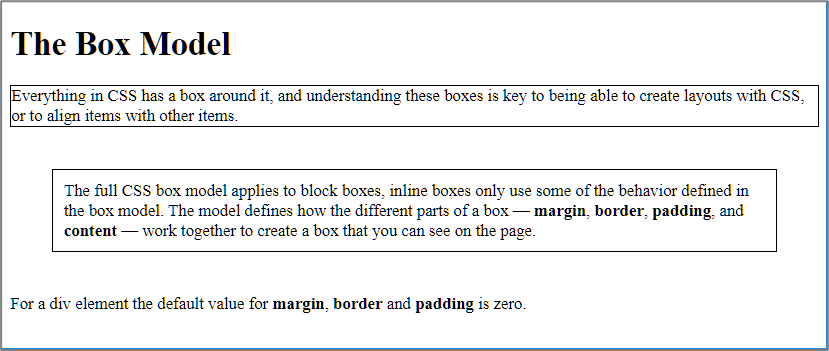
  

### opdracht02
- Open de map **opdracht02**.         

- Creëer een nieuwe webpagina **index.html**. Plaats in de webpagina twee div-elementen. Eén met  id="box1" en één met id="box2".

- Plaats in de eerste div de tekst "Ik ben het eerste div-element" en plaats in de tweede div Lorem Ipsum-tekst.

- Link **style.css** aan je webpagina en voeg CSS-code toe zodat *box1* een oranje rand krijgt met een breedte van 5 pixels en *box2* een blauwe rand met een breedte van eveneens 5 pixels.

Te bekomen resultaat:

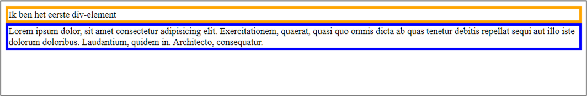

- Stel nu de breedte van *box1* in op 640 pixels en maak vervolgens het browservenster smaller dan 640 pixels.
  
- Merk op dat als je jouw browservenster versmalt, de breedte en de hoogte van *box2* automatisch wordt aangepast, maar dat dit niet het geval is voor *box1*, waar we de breedte vast ingesteld hebben.
  
- Voorzie beide boxes van 20 pixels witruimte tussen de rand en de tekst. 
  
- Stel de hoogte van *box2* in op 20 pixels. 
  
- Als je jouw browservenster smaller maakt, zal bij *box2* sommige tekst buiten de box komen te staan. Verberg deze tekst met behulp van CSS-code.
  
Te bekomen resultaat:

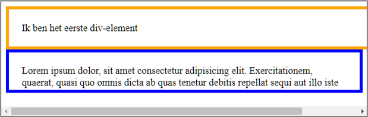

De bovenstaande schermafbeelding is misschien toch niet wat we wensen?

- Vervang bij het eerste div-element 'width: 640px' door 'max-width: 640px;', zodat er geen horizontale schuifbalk meer is.
- Plaats de regels 'height: 20px;' en 'overflow: hidden;' in commentaar.
  

### opdracht03
- Open de map **opdracht03**.       

- Boven en links van de twee div-elementen is er enige witruimte. Gebruik de Chrome Developers Tools om na te gaan van waar deze witruimte vandaan komt en verwijder vervolgens de witruimte.  <!-- kleinere afbeelding -->
  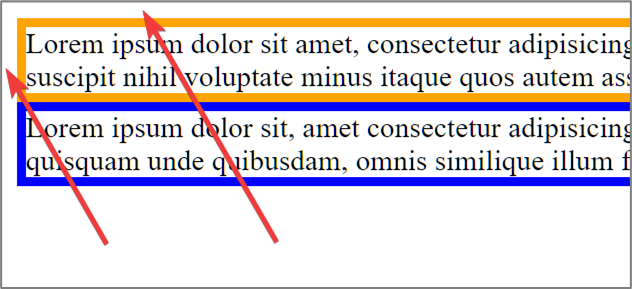

- Geef vervolgens *box1* een ondermarge van 20 pixels.
- En geef *box2* een bovenmarge van 15pixels. 
Waarom heeft het instellen van deze bovenmarge geen effect?

### opdracht04

- Open de map **opdracht04**.     

- Definieer in de bijbehorende css-file de twee ontbrekende classes `alert-info` en `alert-danger` zodat 

  - de tweede paragraaf een 'lightblue' achtergrondkleur en een 'darkblue' rand van 6 pixels breed krijgt.
  - de derde en vierde paragraaf worden weergegeven met een rode linkerrand van 6 pixels breed en een 'lightpink' achtergrondkeur. 

Te bekomen resultaat:

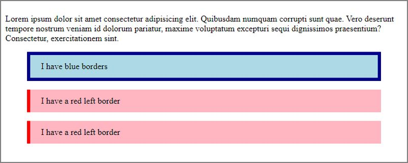

### opdracht05

- Open de map **opdracht05**.
- Geef het main-element een breedte van 80% en centreer het element.
- Zorg ervoor dat het main-element nooit breder wordt dan 840 pixels.

Te bekomen resultaat bij een schermresolutie van 800x600:

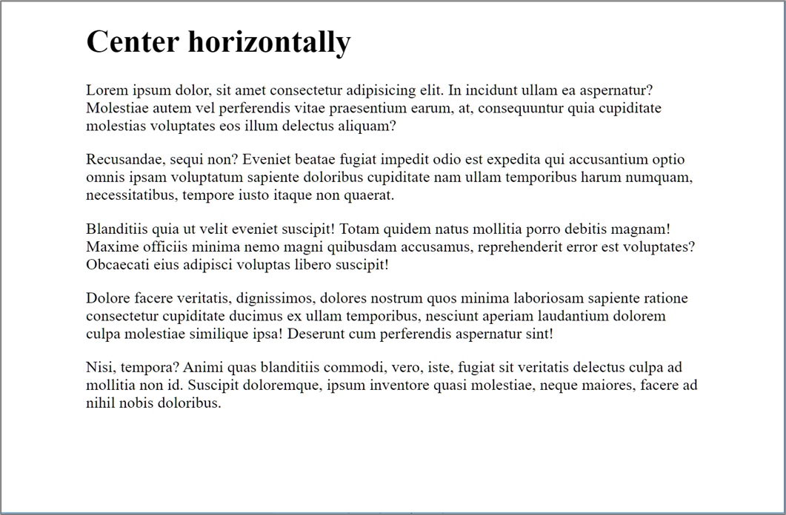

Te bekomen resultaat bij een schermresolutie van 1200x800:

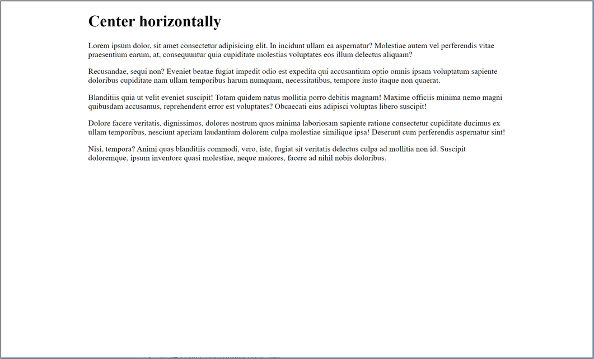

### opdracht06

- Open de map **opdracht06**.
- Voeg verticale schuifbalken toe aan beide articles (zie schermafbeelding hieronder).
- Voeg links en rechts van de teksten in de article-elementen witruimte toe. De afstand tussen de tekst en linker/rechterrand van de article-elementen moet 0,5 rem zijn.
- Voeg 1 rem witruimte toe tussen de twee kaders (articles).

Te bekomen resultaat:

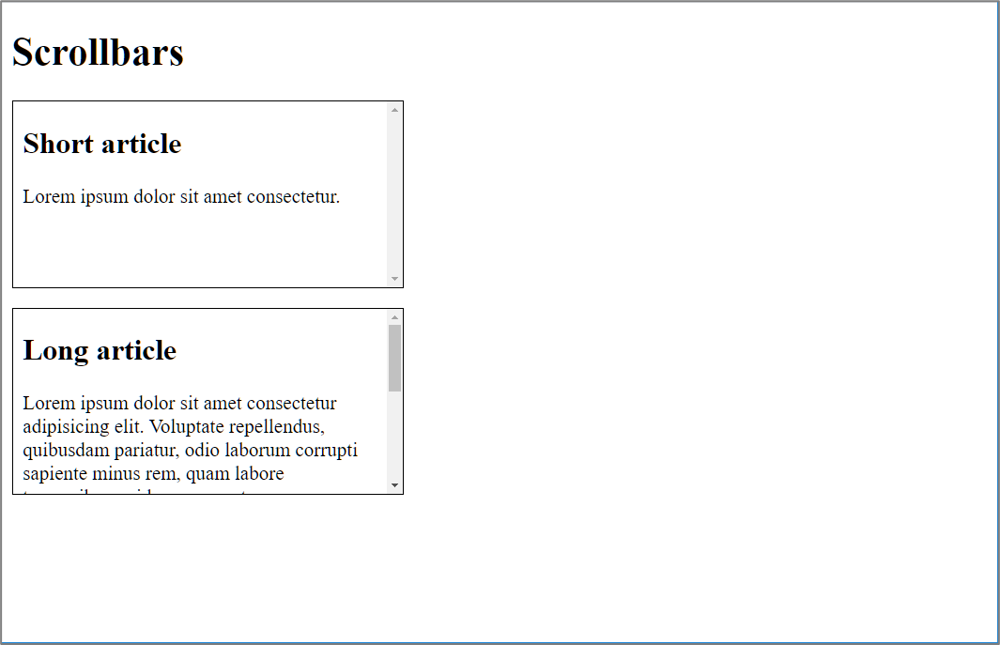

### opdracht07

- Open de map **opdracht07**.
  
  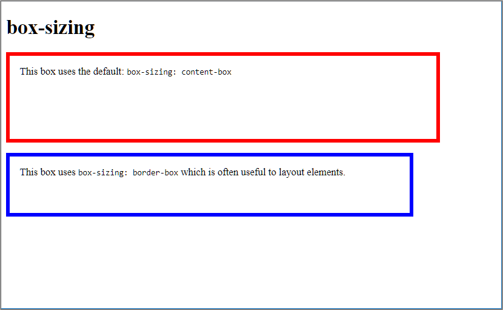

- Zorg ervoor dat de blauwe box even breed en even hoog wordt als de rode box, door zijn CSS-eigenschappen `width` en `height` aan te passen. Je mag hierbij geen andere CSS-eigenschappen wijzigen.

### opdracht08

- Open de map **opdracht08**.

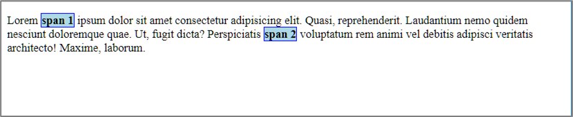

  Merk op dat de twee span-elementen een vet lettertype, een blauwe rand van 1 pixel breed en een lichtblauwe achtergrond hebben.

- Verberg het eerste span-element, maar zorg ervoor dat de ruimte ingenomen door het element behouden blijft. 
Verberg het tweede span-element volledig, nu mag er dus geen witruimte in de plaats van het element komen.

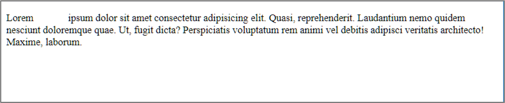

- Maak beide elementen terug zichtbaar door de declaraties in commentaar te plaatsen.
- Geef het tweede span-element een breedte van 100 pixels en een hoogte van 50 pixels. 
  Waarom heeft het instellen van de breedte en de hoogte geen effect?
- Hoe breed zal elk span-element worden als we de css-eigenschap `display` instellen op `block`? 
Voer dit effectief uit en controleer of je antwoord juist was.

## Oefening 2 - Card with badges

Open de map **oefening02-card-with-badges**.

In deze oefening moet je CSS toevoegen aan het bestand **main.css** totdat je het onderstaande resultaat bekomt. Een beschrijving van de toe te voegen CSS vind je onder onderstaande screencast. Het is verplicht om in deze oefening gebruik te maken van de **CSS logical properties and values**. Je moet dus bijvoorbeeld in plaats van de `width` property de `inline-size` property  gebruiken.

<kbd> 
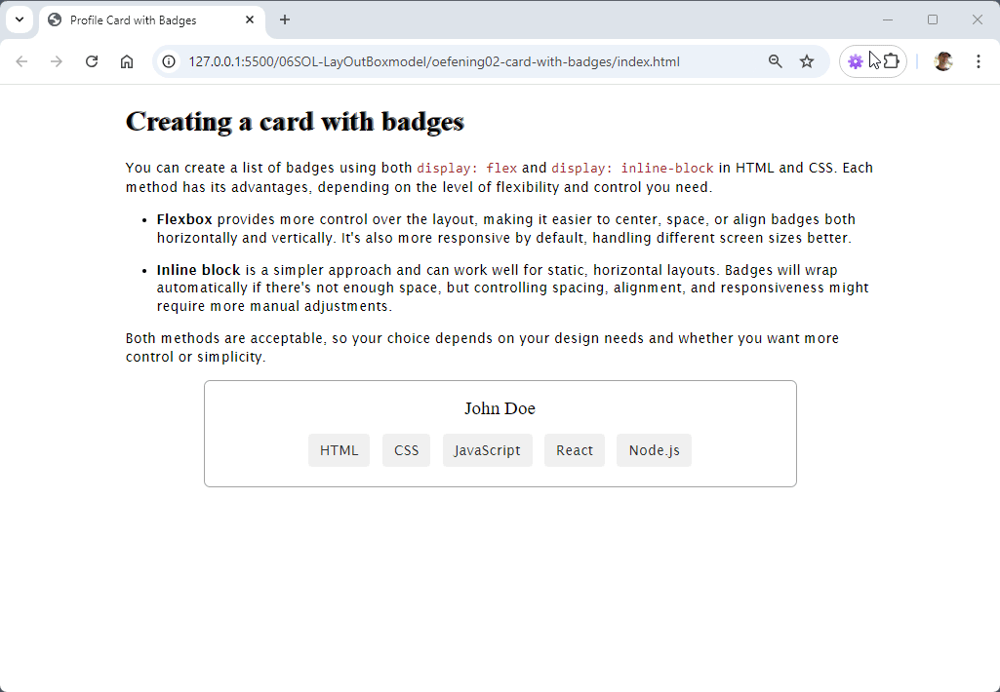
</kbd>

- Werk in deze webpagina met `box-sizing: border-box` i.p.v met `box-sizing: content-box`.
- Stel het lettertype voor de koppen in op **Lucida Serif** en gebruik voor de overige tekst **Lucida Sans**.
- Stel voor het h1-element een grijze tekstschaduw in (naar keuze).
- Stel de regelhoogte voor de webpagina in op 1,3.
- Verwijder de marges bij het body-element en stel de lettergrootte in op 18 pixels.
- Het container-element mag maximaal 960 pixels breed zijn, moet gecentreerd zijn en heeft steeds minimum 24 pixels linker- en rechtermarge.
- Voor het div-element met class **profile-card** is:
  - de linker- en rechtermarge gelijk aan 100 pixels
  - er een licht afgeronde rand van 1 pixel breed met een donkergrijze kleur 
  - de afstand tussen de tekst en de rand 20 pixels
  - alle tekst gecentreerd
- Voor het div-element met class **card-title** is:
  - de lettergrootte 1,5 rem.
  - er een vet lettertype gebruikt met een gewicht van 500
  - de ondermarge ingesteld op 0,67 rem
- De vijf badges HTML, CSS, JavaScript, React en Node.js zijn licht afgerond en hebben verder de volgende opmaak:
  - de tekstkleur is \#333 en de achtergrondkleur is \#f0f0f0
  - de boven- en onderpadding van deze elementen is 7 pixels
  - de linker- en rechterpadding is 15 pixels 
  - de marges zijn ingesteld op 5 pixels
- Wanneer je met de muis beweegt over een badge dan wordt de muiscursor een handje en wordt de achtergrondkleur van de badge gewijzigd in \#ddd.
