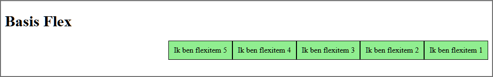
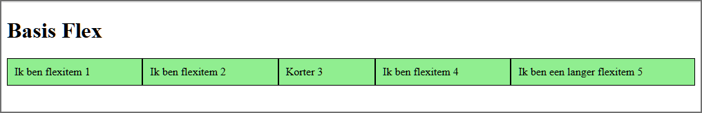
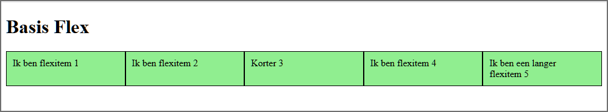
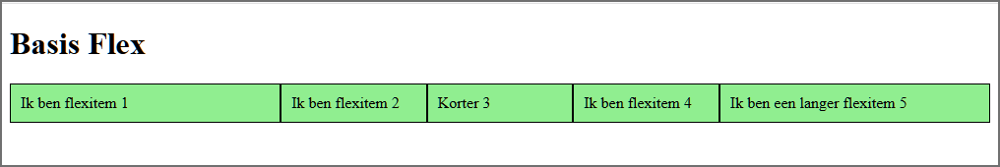
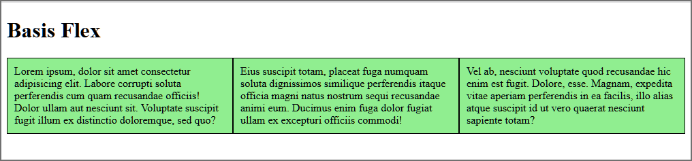
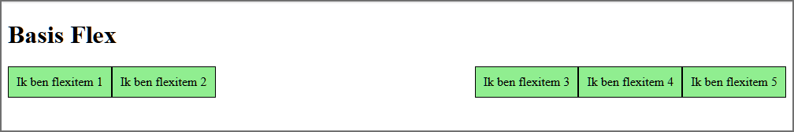
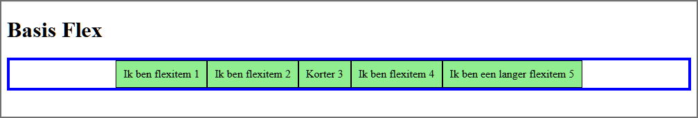
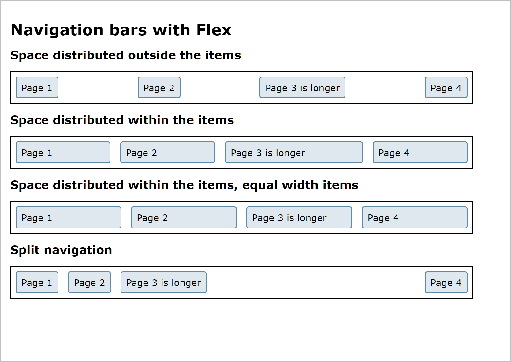
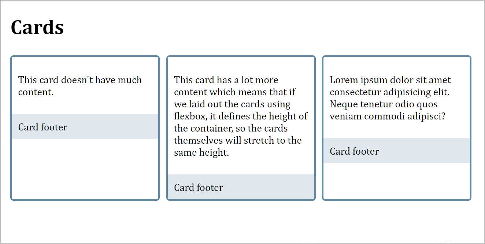
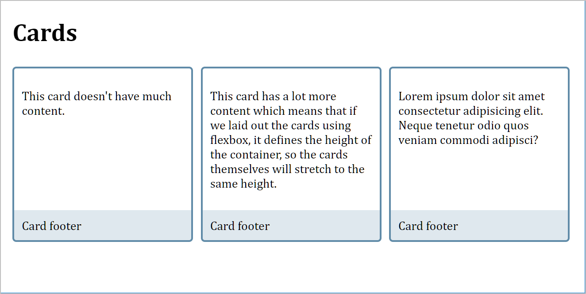

# Les 7 - Flex Layout

## Oefening 1: Basis Flex Layout

- Open de map **01-basis_flex_layout** in Visual Studio Code.

- **opdracht1.html**

  - Maak van het element met `class="flex-container"` een 'flex container' (block-level). Merk op dat de 'flex items' de breedte van hun 'content' innemen.<br>
  - Standaard groeien 'flex items' niet, maar krimpen ze wel. Controleer dit door met jouw muis je browservenster smaller en breder te maken.
  - Verander de richting zodat je het volgende bekomt:

    

- **opdracht2.html**

  - Maak opnieuw van het element met `class="flex-container"` een 'flex container' (block-level) en stel de breedte van de 'flex container' vast in op 525 pixels. Voeg tevens een blauwe rand toe aan de container met een breedte van 5 pixels.
  - Controleer in Firefox met de Flexbox Inspector hoeveel elk item gekrompen is.
  - Wat zal het effect zijn als je `flex-wrap` instelt op `wrap`? <br>Stel effectief `flex-wrap: wrap` in op de flex-container, om je antwoord te controleren.

- **opdracht3.html**

  - Laat de items groeien zodat je het onderstaande bekomt:

    

  - Controleer in Chrome hoeveel elk item gegroeid is.

- **opdracht4.html**

  - Maak alle items even breed.

    

- **opdracht5.html**

  - Maak onderstaande layout. De 'content'-breedte van het eerste en het laatste item is het dubbele van de 'content'-breedte van de andere items. Controleer je resultaat met de Developer Tools.

    

- **opdracht6.html**

  - Controleer met de Developer Tools of alle items even breed zijn.
  - Maak alle items even breed.

    

- **opdracht7.html**

  - Verplaats de beschikbare ruimte zodat deze tussen 'flexitem 2' en 'flexitem 3' komt te staan:

    

- **opdracht8.html**

  - Centreer de items binnen de container:

    

## Oefening 2: Navigation bars

Om een navigatiebalk te maken gebruiken we meestal een 'bulleted list', waarbij we de list items horizontaal afbeelden.

```html
<nav>
  <ul>
    <li><a href="#">Page 1</a></li>
    <li><a href="#">Page 2</a></li>
    <li><a href="#">Page 3 is longer</a></li>
    <li><a href="#">Page 4</a></li>
  </ul>
</nav>
```

De list items zullen echter meestal niet de volledige breedte van de navigatiebalk innemen. Met Flexbox beschik je over veel mogelijkheden om de overgebleven witruimte te verdelen.

Open de map **02-navigationbars** met de startbestanden in Visual Studio Code en pas het CSS-bestand aan zodat je de onderstaande webpagina bekomt.

Je start best met het verwijderen van padding, margin en de 'bullets' op de ul-elementen.



## Oefening 3: Cards

Open de map **03-cards** met de startbestanden in Visual Studio Code.

1. Plaats de drie cards naast elkaar met behulp van Flex Layout. De witruimte tussen de cards is 5 pixels. Je moet onderstaande schermafbeelding bekomen:

   

2. Denk na over hoe je de Card footers naar beneden kan duwen gebruikmakend van flex. Je moet het volgende resultaat bekomen:

   
