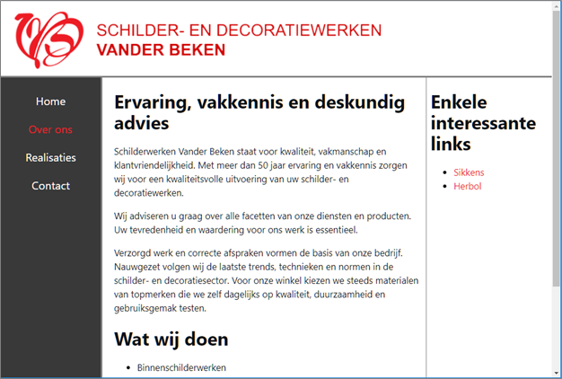

# Les 7: Lay-out CSS Grid

De Developer Tools van de browser Mozilla Firefox zijn handiger om te werken met Grid Layout en Flexbox Layout dan de Developer Tools van Google Chrome. Gebruik dus voor deze oefeningen Mozilla Firefox in plaats van Google Chrome.

## Oefening 1 - Basis CSS Grid

- Open de startmap **oefening01-basis-css-grid** in Visual Studio Code.
- Herwerk de webpagina totdat je de onderstaande lay-out bekomt. Hoe breed elke box moet zijn kan je aflezen in onderstaande schermafbeelding. Probeer zelf deze lay-out te maken of volg onderstaande stapsgewijze procedure.

  _Eindresultaat_

  

  Stapsgewijze procedure:

  - Plaats rond de div-elementen een container-element, bijv. een div-element met class grid-container en stel voor dit element `display: grid` in.
  - Definieer vervolgens met `grid-template-columns` een raster met 4 kolommen van elk 150 pixels breed.<br>
    Tip
  - Maak vervolgens gebruik van `grid-row` en `grid-column` om de grid-items te positioneren.

<br>

## Oefening 2 - Learn CSS Grid

Open de startmap **oefening02-learn-css-grid** in Visual Studio Code.

Om tekst zowel horizontaal als verticaal te centreren kan je CSS Grid gebruiken. Dit wordt gedemonstreerd in de startbestanden van deze oefening. Het is hierbij niet nodig om de tekst in een `<span>`-element of een `<p>`-element te stoppen. Dit komt omdat "each contiguous run of text that is directly contained inside a _grid container_ is wrapped in an anonymous _grid item_", bron : [CSS Grid Layout Module Level 1](https://www.w3.org/TR/css-grid-1/#grid-items).

Breid de webpagina uit met onderstaand diagram LEARN GRID.

Maak hierbij gebruik van Grid Layout en positioneer de vierkanten op de grid met behulp van lijnnummers.

Opmaak vierkanten:

- de zijden van de vierkanten zijn 5 rem groot;
- tussen de vierkanten is er een witruimte van 0,2 rem;
- de lettergrootte is 2 rem en de letterkleur is 'darkblue';
- de achtergrondkleur van de vierkanten is 'cyan';
- de rand is 1 pixel breed en de kleur is 'darkblue'.
- de letter in het vierkant is zowel horizontaal als verticaal gecentreerd.

Er zijn verschillende werkwijzen mogelijk om onderstaand diagram te bekomen. Wellicht is het, het eenvoudigst om elk vierkant (letter) van een classname (of id) te voorzien - bijv. .box1, .box2, - en vervolgens elk vierkant expliciet te positioneren op de grid. Maak voor het positioneren van de grid items bijvoorbeeld gebruik van de CSS properties `grid-column` en `grid-row`.

Te bekomen resultaat:


<br>

## Oefening 3 - Box alignment in CSS Grid

- Open de startmap **oefening03-box-alignment-css-grid** in Visual Studio Code.

- Herwerk de webpagina totdat je de onderstaande lay-out bekomt. Probeer zelf deze lay-out te maken of volg onderstaande stapsgewijze procedure.

  

  Stapsgewijze procedure:

  - Maak 'grid containers' van de elementen met `class="grid-container"`, zodat alle p-elementen grid items worden.

    Merk op dat er geen 'margin collapse', meer optreedt.

  - Verwijder de marges van alle p-elementen.
  - Plaats in beide 'grid containers' de zes p-elementen in een raster van 2 rijen en 3 (gelijke) kolommen.

- Pas de webpagina verder aan totdat je de onderstaande lay-out bekomt. Probeer zelf de lay-out aan te passen of lees de stapsgewijze procedure onder de schermafbeelding.

  

  Stapsgewijze procedure:

  - grid1:
    - Centreer alle grid-items verticaal
    - Lijn alle grid-items links uit.
  - grid2:
    - Lijn alle grid-items rechts uit.
    - Centreer het laatste grid-item verticaal
    - Lijn het laatste grid-item tevens links uit.

<br>

## Oefening 4 - Learn Grid - grid template areas

Open de startmap **oefening04-learn-css-grid-template-areas**.

Voeg CSS-code toe:

- om alle letters horizontaal en verticaal te centreren in hun vierkant;
- en om onderstaande lay-out te maken. Maak hierbij gebruik van de `grid-template-areas`-property. Het is hier dus de bedoeling om deze keer geen lijnnummers te gebruiken.

Te bekomen eindresultaat:


<br>

## Oefening 5 - Fotogalerij

Open de startmap **oefening05-fotogalerij** in Visual Studio Code.

Met CSS grid is het mogelijk om een 'responsive' fotogalerij te maken zonder gebruik te maken van media queries (@media zie verderop Les 9).

Pas de CSS-code aan zodat de breedte van de pagina volledig opgevuld wordt met foto's. De foto's mogen nooit smaller worden dan 200 pixels en de overblijvende ruimte moet gelijk verdeeld worden over de verschillende foto's. De ruimte tussen de foto's is overal 15 pixels. Hieronder vind je drie schermafbeeldingen bij verschillende paginabreedtes.

**Tip:** om de afbeeldingen responsive te maken stel je voor de img-elementen (max-width: 100%) in.

Probeer zelf de lay-out te maken of bekijk eerst hieronder de tips (klik op het **zwarte driehoekje** om de tips weer te geven):

<details>
<summary><b>Tips</b></summary>

> - Gebruik het main-element als grid-container.
> - Maak gebruik van repeat(auto-fill, ...) voor het instellen van grid-template-columns.
> - Vergeet niet om de img-elementen in het main-element responsive te maken (max-width: 100%).

</details>

**Schermafbeelding bij een paginabreedte van 800 pixels.**


**Schermafbeelding bij een paginabreedte van 1024 pixels.**


**Schermafbeelding bij een paginabreedte van 2090 pixels.**


<br>

## Oefening 6 - Vander beken

- Open de startmap **oefening06-vanderbeken** in Visual Studio Code.
- Maak gebruik van de **normalize.css** van Nicolas Gallagher ([https://necolas.github.io/normalize.css/](https://necolas.github.io/normalize.css/)).<br>
  Importeer de file in **main.css**.<br>
  Merk op dat deze file onder andere de body margin instelt op 0 en de lettergrootte van het h1-element op 'over_ons.html' instelt.
- Stel voor alle elementen `box-sizing: border-box` in.
- Voorzie links en rechts van de inhoud van header, main en footer 15 pixels witruimte .
- Maak een ‘two-column page layout’ waarbij de navigatiebalk in de linkse kolom komt te staan. Maak hiervoor gebruik van CSS Grid. De eerste kolom maak je ongeveer 20 karakters breed en de tweede kolom krijgt alle overige ruimte.
- Vanaf 960 pixels mag de paginainhoud niet meer verbreden en moet je deze centreren.
- Zorg voor een beetje extra witruimte boven en onder het logo door de top- en bottom padding van de header in te stellen op 10 pixels.
- Halveer de boven- en ondermarges van de paragraaf in de footer (1em naar 0.5em)
- Voeg de volgende kleuren toe:
  - body
    - achtergrondkleur: `#525252` (grijs)
  - header, main
    - achtergrondkleur: `white`
- Stel een 'gutter' is van 3 pixels voor de grid. En geef de container een lichtere achtergrondkleur (grey) dan de body.

<details>
<summary><b>Tips</b></summary>

<br>

<details>
<summary><b><i>Tip container</i></b></summary>

> Voeg aan alle html-bestanden een `<div class="container">` toe. Dit element kan je dan gebruiken als grid-container, alsook om de paginainhoud te centreren en de breedte ervan te beperken tot maximum 960 pixels.

</details>
<details>
<summary><b><i>Tip kolombreedte 20 karakters</i></b></summary>

> Gebruik de lengte-eenheid `ch`. De `ch` is een [font-relative length](https://developer.mozilla.org/en-US/docs/Web/CSS/length#font-relative_lengths).

</details>

</details>

Je moet uiteindelijk onderstaand resultaat bekomen.


<br>

Webpagina **over_ons.html**:

- Plaats `section` en `aside` naast elkaar met behulp van een twee kolommen grid. De breedte van de aside-kolom moet bepaald worden door het langste woord in de kolom, nl. “interessante”. De eerste kolom moet alle overige ruimte krijgen. De ruimte tussen de twee kolommen is 10 pixels.
- Geef de aside-kolom nog een grijze linkerrand van 1 pixel en wat padding-left/right (7px).

<details>
<summary><b>Tip</b></summary>

> Er zijn verschillende mogelijke werkwijzes om aan het `main`, `section` en `aside`-element in **over_ons.html** stijlen toe te voegen, bijvoorbeeld:
>
> - in over_ons.html een id toevoegen aan het main-element `<main id="over_ons">`<br>
> - of een extra CSS-file **over_ons.css** creëren, die je enkel gebruikt bij **over_ons.html**.

</details>

<br>



<br>

## Oefening 07 - Game page

Open de startmap **oefening07-gamepage** en bekijk hieronder de eerste schermafbeelding.

Voer de volgende aanpassingen uit:

1. Voeg onder het `h1`element in het **Board**-item een `p`element toe met daarin 120 'lorem ipsum'-woorden. Je kan hiervoor gebruikmaken van emmet: `p>lorem120`
2. Creëer een grid bestaande uit twee kolommen en drie rijen.
   - De eerste kolom is voor de 'Game Title', de 'Stats' en de 'Score'.
     Deze kolom moet de breedte krijgen van de inhoud (content). Je stelt deze dus in op 'auto'.
     De tweede kolom is voor het 'Board' en de 'Controls' en krijgt alle overblijvende ruimte (leftover space).
   - Voor de eerste en de laatste rij moet de hoogte aangepast worden aan de inhoud.
     De middelste rij krijgt alle overgebleven ruimte.
3. Positioneer de vijf items op de grid. Maak voor het positioneren van de grid items gebruik van `grid-column` en `grid-row`. Het **Board**-item overspant twee grid-rijen. Het **Controls**-item is gecentreerd onder het **Board**-item.

   

4. Zorg ervoor dat het **Stats**-item niet mee verhoogt als de pagina smaller wordt. Zie onderstaande schermafbeelding:

   

<br>

## Oefening 8 - The Nature company

Bekijk eerst het [eindresultaat](https://web-development-i.github.io/07SOL-LayoutCSSGrid/oefening08-nature-company/) van deze oefening. Verbreed en versmal het browservenster en controleer dat het eindresultaat goed 'responsive' is voor tablets en laptops.

Open daarna de startmap **oefening08-nature-company** in Visual Studio Code en voer onderstaande opdrachten uit op de startbestanden:

- Stel de font-family voor de webpagina in op `Arial, Helvetica, sans-serif;`
- Geef de div.container wat `padding: 24px  24px 30px 56px;`
- Maak de h1-elementen groter (4.5em), vetter (900) en zet om naar hoofdletters.
- Stel voor de h2-elementen de font-weight in op 500 en voorzie top en bottom marges `margin-top: 56px; margin-bottom:30px;`

#### Layout van de drie foto's:

- Verwijder margin, padding en bullets bij de lijst
  ```
  margin: 0;
  padding: 0;
  list-style-type: none;
  ```
- Plaast met behulp van CSS Grid de drie foto's naast elkaar met een tussenruimte van 12px (0.75rem)). Maak de drie kolommen even breed en flexibel.
- Maak de foto's responsive door voor de img-elementen `width: 100%;` in te stellen.

#### Layout van de footer

Hiervoor zijn er veel verschillende werkwijzes mogelijk. We zullen een grid gebruiken met 9 kolommen en één rij:

- De eerste en de laatste kolom dienen enkel om de 7 andere kolommen te centreren.
- De even kolommen (2, 4, 6, 8) bevatten de content (h3, ul). Maak deze allemaal even breed en flexibel.
- De oneven kolommen (3,5,7) creëren witruimte. Geef deze een kolombreedte van 48px (3rem).

Je kan dus de volgende declaratie gebruiken voor grid-template-columns

```
grid-template-columns: minmax(0, 1fr) 1fr 48px 1fr 48px 1fr 48px 1fr minmax(0,1fr);
```

#### Overige opmaak footer:

- Voorzie 84px witruimte tussen de foto's en de footer.
- Verwijder margin, padding en bullets bij de lijsten.
- Stel de regelhoogte voor de lijsten in op 2.
- Geef de h3-elementen een grijze tekstkleur nl. rgb(17, 17, 17) en stel font-weight in op 500.
- Geef de hyperlinks een grijze tekstkleur nl. rgb(117, 117, 117) en verwijder de onderstreping.

Te bekomen eindresultaat:


## Oefening 9: Dialog Box (position)

- Open de map **05-position**.
- Positioneer de 'message box' in het midden van het main-element en op 150 pixels van de bovenkant van het main-element.
- Postioneer het svg-element 'close-button' rechtsboven in de 'message box'.

**Tip** Gebruik `position:absolute` voor het positioneren van de 'message box' en de 'close-button'.

Te bekomen resultaat:


