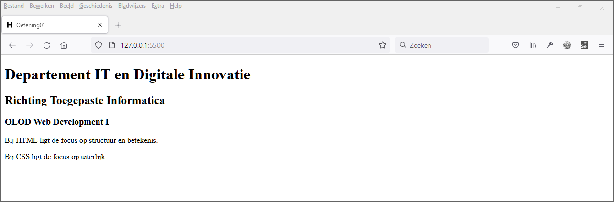
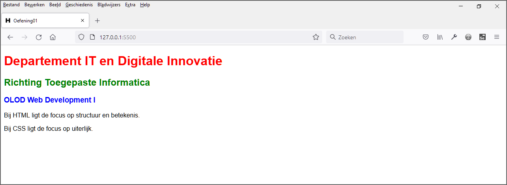

# Oefeningen les 1: HTML basis deel1 - CSS introductie

## Oefening 1
Maak in de map **oefening01** een nieuw bestand **index.html**. Zorg dat de pagina er als volgt uit ziet. In de body maak je hiervoor gebruik van de volgende elementen: **h1, h2, h3 en p**. Let op de details, dit is een Nederlandstalige pagina (stel de taal in bij het **html** element) en de titel is *Oefening01* (stel dit in via het **title** element).

Maak een map **css** en maak daarin een nieuw css-bestand **main.css** aan.
Zorg voor een schreefloos lettertype (sans serif) en geef elk van de headings een andere tekstkleur nl. red, green en blue (gebruik de CSS property **color**).

## Oefening 2

Maak een eenvoudige website bestaande uit een html-pagina, een css-bestand en een afbeelding. Bijvoorbeeld zoals [My test page](https://web-development-i.github.io/01SOL-HTMLBasisDeel1-CSSIntro/oefening02/).

Kies zelf een thema. Maak bijvoorbeeld een webpagina over één van je hobby's en zoek een bijpassende afbeelding op internet.

Plaats vervolgens jouw website online. Volg hiervoor de instructies op [Publishing via GitHub](https://developer.mozilla.org/en-US/docs/Learn/Getting_started_with_the_web/Publishing_your_website#publishing_via_github).
