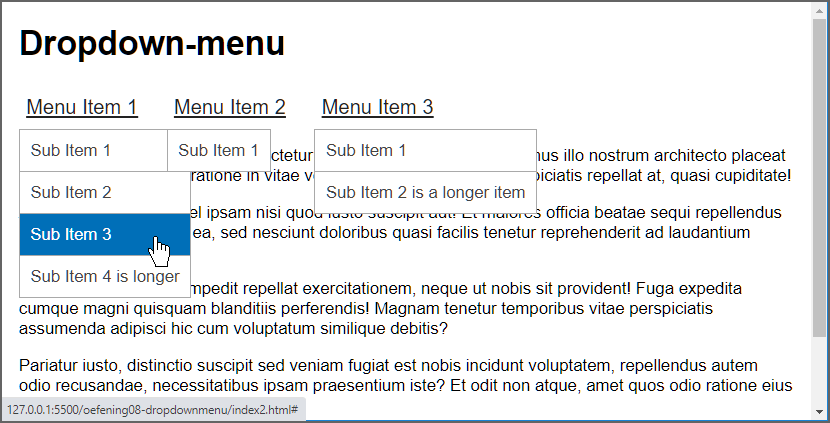

# Les 10: Animaties

## Oefening 1 - button

- Open het [eindresultaat](https://web-development-i.github.io/10SOL-Animaties/oefening01-button/) en hover over de knop.
- Open daarna de startmap **oefening01-button** in Visual Studio Code, start de Live Server en voer onderstaande stappen uit:
  - Plaats de twee svg-elementen in het button-element naast elkaar met behulp van Flexbox.
  - Wijzig de opmaak van de lichtgrijze knop:
    - achtergrondkleur: groen
    - geen border
    - afgeronde hoeken (5 pixels)
    - witruimte tussen de inhoud en de rand van de knop: 15 pixels
  - Zorg bij de knop voor dezelfde animatie als in het eindresultaat: als je de muiscursor over de knop beweegt moet deze met een factor 1,05 vergroot worden en bij het verlaten van de knop moet de knop terug zijn oorspronkelijke grootte krijgen. Gebruik een korte animatie (bijv. 200ms)
- Extra oefening: wijzig bij het hoveren over de knop ook de kleur van de knop. Gebruik de color picker in de Developer tools om een fellere groene kleur te creëren. 
  **Tip** [Demo color picker](https://web-development-i.github.io/10EX-Animaties/docs/images/colorpicker1.gif)

## Oefening 2 - wiggle button

- Bekijk het [eindresultaat](https://web-development-i.github.io/10SOL-Animaties/oefening02-wiggle-button/).
- Open de startmap **oefening02-wiggle-button** in Visual Studio Code.
- Bekijk de CSS-code. Deze bevat reeds een CSS animation 'wiggle'. Zorg ervoor dat bij het laden van de pagina de wiggle-animatie twee keer wordt uitgevoerd op de knop.

## Oefening 3 - drie bollen

- Open het [eindresultaat](https://web-development-i.github.io/10SOL-Animaties/oefening03-drie-bollen/), hover over de container en wacht ... .
- Open vervolgens de startmap **oefening03-drie-bollen** in Visual Studio Code, start de Live Server en voer onderstaande stappen uit:
  - Vorm de vierkanten om tot bollen.
  - Gebruik de optionele alpha component van de rgb() functie om de eerste (alpha component: 40%) en de tweede knop (alpha component: 70%) gedeeltelijk transparant te maken, zodat het lijkt alsof ze een lichtere kleur hebben.
  - Bij het hoveren over de container moet de volgende animatie uitgevoerd worden:
    - De eerste bol vergroot met een factor 2. De tijdsduur voor de animatie is 300 milliseconden.
    - Nadat deze animatie beëindigd is vergroot de tweede bol met een factor 2. De tijdsduur voor deze animatie is 1 seconde.
    - Nadat deze animatie beëindigd is vergroot de derde bol met een factor 2. De tijdsduur voor deze animatie is 2 seconden.
  - Als de muiscursor de container verlaat moet alles terug naar zijn oorsponkelijke toestand terugkeren.

## Oefening 4 - grafiek

- Open het [eindresultaat](https://web-development-i.github.io/10SOL-Animaties/oefening04-grafiek/) en hover over de grafiek.
- Open de startmap **oefening04-grafiek** in Visual Studio Code en start de Live Server.
- Maak de grafiekanimatie na. De waarden in de grafiek moeten bij het hoveren over de grafiek wijzigen van 100, 175 en 125 in het jaar 2020 naar de huidige waarden 250, 350 en 75.

## Oefening 5 - slide in

- Bekijk het [eindresultaat](https://web-development-i.github.io/10SOL-Animaties/oefening05-slide-in/).
- Open de startmap **oefening05-slide-in** in Visual Studio Code en start de Live Server.
- Maak de slide-in animatie na. De verschuivingen mag je schatten, deze hoeven niet exact overeen te komen met het eindresultaat. Je start de animatie pas 1 seconde na het laden van de webpagina.

## Oefening 6 - moving text

- Open het [eindresultaat](https://web-development-i.github.io/10SOL-Animaties/oefening06-moving-text/) en hover over de blauwe box.
- Open de startmap **oefening06-moving-text** in Visual Studio Code en zorg ervoor dat, zoals in het eindresultaat, de animatie kan afgespeeld worden door te hoveren over de blauwe box. 
  **Tip** Voeg reeds bij het laden van de pagina de animatie toe aan de blauwe box, maar pauzeer ze onmiddellijk.

## Oefening 7 - vinyl

- Bekijk het [eindresultaat](https://web-development-i.github.io/10SOL-Animaties/oefening07-vinyl/).
- Open de startmap **oefening07-vinyl** in Visual Studio .
- Centreer de tekst binnen het div-element horizontaal en verticaal. 
- Maak de animatie. 
  **Tip** Creëer een CSS animation die de bol 360° draait en laat deze animatie oneindig lopen.

## Oefening 8 - Dropdown-menu

- Open het [eindresultaat](https://web-development-i.github.io/10SOL-Animaties/oefening08-dropdownmenu/) en probeer het dropdown menu uit.
- Open de startmap **oefening08-dropdownmenu** in Visual Studio Code en start de Live Server.
- Voeg in 'index.html' verwijzingen toe naar de CSS-bestanden 'main.css' en 'dropdown.css'. De oplossing van deze oefening plaats je in 'dropdown.css'.
- Volg onderstaande procedure om het dropdown-menu te maken. Vanwege de lengte van de procedure zullen we deze opsplitsen in twee delen. We starten eerst met het ombouwen van de geneste lijst totdat we de onderstaande schermafbeelding bekomen.
  
  ### Deel 1

  

  - Reset de ul-elementen van het dropdown-menu. M.a.w verwijder de bullets, padding en margin.
  - Voor de drie hyperlinks in het hoofdmenu:
    - lettergrootte: 1,2 rem
    - tekstkleur: donkergrijs (`#222`)
    - `padding: 10px 7px` 
      **Tip** `display: block`
    - muiscursor: `default`
    - voeg een onderstreping toe
  - Voor de hyperlinks in de submenu's:
    - Normale toestand:
      - tekstkleur: donkergrijs (`#444`)
      - padding: 10 pixels 
        **Tip** `display: block`
      - verwijder de onderstreping 
    - Als er gehoverd wordt over de hyperlinks:
      - witte tekstkleur op een blauwe achtergrond (`#006fb8`).

  - Als we de border-eigenschap gebruiken om de submenu's een rand te 
  geven, blijft er een rand zichtbaar als we de hoogte instellen op nul.  We maken daarom de randen met de volgende truk.
    - Stel de achtergrond van het submenu in op `darkgrey`.
    - Stel de achtergrond van de hyperlinks in op wit.
    - Geef de hyperlinks een marge van 1px. Daar marges transparant zijn, lijkt het hierdoor alsof het submenu borders heeft. 

  - Gebruik tenslotte flexbox om de drie hyperlinks in het hoofdmenu naast elkaar te plaatsen en haal de submenu's uit de 'normal flow' met `position: absolute`. Je moet nu als resultaat hetzelfde bekomen als in bovenstaande schermafbeelding.

  ### Deel 2

  - Bij het laden van de webpagina verberg je de submenu's (door voor deze elementen de 'max-height' in te stellen op 0 pixels en 'overflow' op 'hidden') en bij het hoveren over een hoofdmenu-item geef je het bijhorende submenu opnieuw weer (om een submenu opnieuw weer te geven stel je de 'max-height' in op bijvoorbeeld '200px'. In principe is 165 pixels voldoende, je kan dit controleren met de developer tools).
  - Voeg bij de submenu's een CSS transition toe voor de property `max-height`. Zorg hierbij voor een tragere voorwaartse transitie (500ms) en een snellere achterwaartse transitie (200ms).
  - Geef de menu-items in het hoofdmenu bij het hoveren een grijze achtergrondkleur (`#ddd)` en verwijder de onderstreping. Stel deze eigenschappen in op de li-elementen (zijn de parents van de submenu's) in plaats van op de a-elementen. Zo blijven de eigenschappen behouden bij het hoveren over de submenu's.
  - Voorzie eventueel nog wat extra witruimte (20px) aan de linkerkant van de menu-items, behalve bij het eerste item. 

