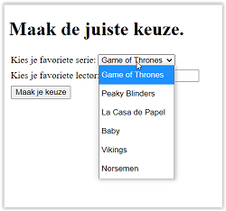
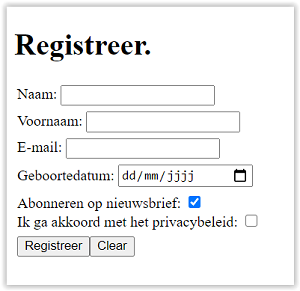
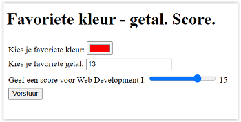

# Oefeningen les 3: Tabellen en formulieren

## Oefeningen Tabellen
Alle oefeningen over tabellen worden opgelost in de map **01-tabellen**.
### **Oefening 1**
Maak in de map **oefening1** een nieuw bestand **index.html**. 
Schrijf correcte html om een pagina te bekomen volgens onderstaande screenshot. Om de basis structuur van een html pagina snel aan te maken in de editor, gebruik je emmet (!tab).

**Weergave borders:** in de map **css** is er reeds een bestand **styles.css**. Link dit css-bestand aan je html pagina.      
Voeg de juiste stijldeclaraties toe in je css bestand zodat de borders van de tabel worden weergegeven.     
**TIP**: bekijk het voorbeeld uit de slides.

Denk eraan: **valideer** steeds je code op https://validator.w3.org/.

---
### **Oefening 2**

Maak in de map **oefening2** een nieuw bestand **index.html**. 
Schrijf correcte html om een pagina te bekomen volgens onderstaande screenshot. Om de basis structuur van een html pagina snel aan te maken in de editor, gebruik je emmet (!tab).

Voeg de borders toe zoals in oefening 1.     
Om de borders van de geneste tabellen niet weer te geven voeg je een class attribuut toe aan de geneste tabellen met de waarde **noborder**. Voeg vervolgens volgende code toe aan je css bestand:

    .noborder,          
    .noborder td {           
       border: 0px;             
    }

---
### **Oefening 3: Likwiepedia**
De Likwiepedia die in deze oefening gemaakt wordt is een eenvoudigere versie van de Liquipedia pagina voor het WCS Montreal. De focus ligt op het nabouwen van de verschillende tabellen die op deze pagina te vinden zijn.

In de map **oefening3** vind je een map _images_ met de afbeeldingen en het bestand _index.html_ waar je de tabellen moet aan toevoegen.

Voeg de borders toe zoals in oefening 1.

Hieronder zie je het resultaat van de drie tabellen.

Maak eerst de **Prize pool** table. 

Vervolgens de **Participant** table

Tot slot de **Distribution** table. _Merk op dat deze tabel per rij 5 kolommen (zonder colspan) heeft!_

---
### **Extra oefening tabellen - Books**
Maak in de map **oefening4** een index.html aan en maak onderstaande tabel. De afbeeldingen bevinden zich in de map images.       
Voeg de borders toe zoals in oefening 1.

        

-----
## Oefeningen Formulieren

In de map **oefeningen** vind je enkele eenvoudige oefeningen waar we een aantal formulieren aanmaken.     
Je stuurt steeds je formulier naar je mail client (outlook, ...). Hiervoor geef je volgende waarde aan het action-attribuut in je form tag: "mailto:*je hogent e-mailadres*".           
Zorg ervoor dat als je op de tekst (label) van een formulier element klikt, je focus krijgt in het overeenkomende formulier element.             
Binnen elk formulier plaats je elk label- en formulierelement samen tussen **div** elementen. Er ligt in elk bestand een link naar *css/main.css*. Deze zorgt ervoor dat er witruimte gecreëerd wordt tussen de form elementen.         
Schrijf correcte html, test deze op https://validator.w3.org/nu/, om onderstaande screenshots in je browser weer te geven.

-----

### **Oefening 1: Aanmeldingsformulier**

Open bestand oefening01.html. Maak onderstaand aanmeldingsformulier.       
       
   
E-mail en wachtwoord zijn verplichte velden. Bij e-mail voorzie je een voorbeeld in de input (zie figuur hierboven).   
Het formulier wordt verstuurd met de POST method naar *je hogent e-mailadres* met als onderwerp **Aanmelden**       

-----

### **Oefening 2: Keuzelijsten**

Open bestand oefening02.html. Maak onderstaand formulier met twee keuzelijsten.    
De eerste is een selectlist (één keuze) en de tweede maakt gebruik van een datalist.

          

       
Bij de tweede lijst krijg je onderstaand resultaat als je **st** in het input veld typt.     
      
Het formulier wordt verstuurd met de POST method naar *je hogent e-mailadres* met als onderwerp **Keuzes**  

        

-----

### **Oefening 3: Maak je afspraak**

Open bestand oefening03.html. Maak onderstaand formulier met datum en tijd veld en een tekst veld met meerdere lijnen (5 rijen en 60 karakters per rij).   
Alle velden zijn verplicht en het tekstveld heeft een voorbeeldtekst.    

          

      
Het formulier wordt verstuurd met de POST method naar *je hogent e-mailadres* met als onderwerp **Afspraak**                       
 

        

-----
### **Oefening 4: Registreer**

Open bestand oefening04.html. Maak onderstaand formulier.   
Naam, voornaam, e-mail en privacybeleid zijn verplicht in te vullen.
Abonneren op nieuwsbrief staat reeds aangevinkt.          
Er zijn twee knoppen: één om te verzenden en één om het formulier naar zijn oorspronkelijke vorm te brengen.

            
Het formulier wordt verstuurd met de POST method naar *je hogent e-mailadres* met als onderwerp **Registreer**                       
 

        

-----
### **Oefening 5: Poll**

Open bestand oefening05.html. Maak onderstaand formulier.   
Je moet bij beide keuzegroepen verplicht één keuze invullen. Meerdere keuzes aanduiden kan niet.    
Er zijn twee knoppen: één om te verzenden en één om het formulier naar zijn oorspronkelijke vorm te brengen.

            
Het formulier wordt verstuurd met de POST method naar *je hogent e-mailadres* met als onderwerp **Poll**                       
 

        

-----
### **Oefening 6: Favorietjes - Score**

Open bestand oefening06.html. Maak onderstaand formulier.      
       
Kies je favoriete kleur. Zorg ervoor dat rood (#ff0000) als kleur staat ingesteld.      
Kies je favoriete getal. Zorg ervoor dat 13 als default staat ingesteld. Je mag geen negatieve waarde kunnen ingeven. Dit is een verplicht veld.     
      
Geef met een slider een score (tussen 0 en 20) aan dit vak. Default waarde is 15.       
Om de score naast de slider weer te geven voorzie je een lege **output** tag met **id="showScore"**. Geef aan de slider (input tag) een **id="score"**.      
          

Het formulier wordt verstuurd met de POST method naar *je hogent e-mailadres* met als onderwerp **Poll**                       
         

        

-----

### **Extra oefening formulieren - BolDotCom**
De bedoeling van deze oefening is om het registratieformulier van de BolDotCom webwinkel na te bouwen. Het uiteindelijke resultaat moet er als volgt uitzien:    

Deze oefening maak je in de map BolDotCom.

**Algemene beschrijving**
Het formulier waarin de accountgegevens worden ingevuld bestaat uit 3 fieldsets: 
- 1 voor de persoonlijke gegevens, 
- 1 voor de inloggegevens, 
- 1 waarin de gebruiker kan aangeven welke nieuwsbrieven hij/zij wilt ontvangen. 

We bouwen ze stuk voor stuk op.      
Merk op: alle verplichte velden staan aangeduid met een rode asterix. Gebruik hiervoor    

    *     

Elke lijn (zie screenshot hierboven) zit in een `
` tag.

Maak een extern css bestand aan (vergeet niet te linken in je html) in de map **css** en voeg volgende code toe     

    div{margin:5px;}
    sup{color:red;}

**Persoonlijke gegevens**     
1. Voeg om te beginnen een form element toe in de main. Alle fieldsets komen hierin te staan.
2. Voeg binnen het formulier een eerste fieldset toe. Deze heeft als legend “Persoonlijke gegevens”.
3. Voeg de verschillende form controls toe. Elk komt binnen een eigen div-element te staan, behalve voornaam/achternaam en straatnaam/huisnummer en bus: die staan per twee in een div-element. Elk element moet ook een label krijgen: als op het label van een veld geklikt wordt springt de cursor naar het bijhorende invoerveld.
    - De aanhef bestaat uit 2 radio buttons. Deze hebben als name “aanhef”. De gebruiker is verplicht een keuze te maken. Standaard is “Mevrouw” geselecteerd.
    - De voornaam en achternaam zijn gewone inputvelden. Hun name is respectievelijk “voornaam” en “achternaam”. Beide zijn verplicht.
    - De bedrijfsnaam is ook een gewoon tekstveld, met name “bedrijfsnaam”. Niet verplicht.
    - Postcode en gemeente is een gewoon tekstveld, met name “postcode_gemeente”. Verplicht in te vullen.
    - Straatnaam en huisnummer en bus zijn twee aparte tekstvelden. Beide zijn verplicht. Kies zelf een gepaste name voor beide.
    - Land is een select list. De gebruiker kan kiezen tussen “België” en “Nederland”. Kies zelf logische waarden voor het name en value attribuut. Standaard is “België” geselecteerd. Men is verplicht een land te kiezen.
    - De extra adresregel is weer een gewoon tekstveld en moet niet ingevuld worden. Kies een logische name.
    - De geboortedatum is een date-veld. Moet niet ingevuld worden.
    - Het telefoonnummer moet verplicht ingevuld worden. Gebruik type “tel”, voeg eventueel pattern toe (zie https://developer.mozilla.org/en-US/docs/Web/HTML/Element/input/tel).

    

**Inloggegevens**
1. Voeg een nieuwe fieldset toe voor de Inloggegevens. Zorg voor de juiste titel in de legend.
2. Voeg de form controls toe
    - Het emailadres is verplicht in te vullen. Gebruik het correcte type zodat enkel geldige emailadressen aanvaard zullen worden. Zet een placeholder met daarin een voorbeeldemailadres.
    - Wachtwoord moet ook verplicht ingevuld worden. Gebruik hier ook het gepaste type zodat sterretjes getoond worden in plaats van het wachtwoord. 

    

**Nieuwsbrief**
1. Voeg de laatste fieldset toe voor de nieuwsbrieven. Zorg voor de juiste titel in de legend.
2. De selectie voor de nieuwsbrieven staat binnen een tabel. Deze bestaat uit 3 rijen en 2 kolommen. De bovenste rij bevat de hoofdingen, de twee volgende rijen bestaan uit een cel met een checkbox en een cel met de uitleg van de bijhorende nieuwsbrief. Beide checkboxen zijn standaard aangevinkt.
3. Voeg tenslotte nog een *verzenden* knop toe.

    

        

-----
## Oefening Van der Beken: tabel - formulier
Open de map **03-VanderBeken**. In deze map vind je de oplossing van de oefening uit les2.     
Het doel is om in de pagina **contact.html**
- de volgende tabel toe te voegen onder de paragraaf *Wij zijn op het bovenstaande adres bereikbaar op de onderstaande ogenblikken*.     
Voeg ook hier weer de nodige css toe in een extern css bestand om de borders zichtbaar te maken.

- het volgende formulier toe te voegen onder de paragraaf *Vul volgend formulier in om een afspraak te maken (Naam - email - telefoon zijn verplicht)*.
Het formulier wordt naar de server verstuurd naar *afspraak.php*, de verstuurde data is gevoelige informatie.
Plaats alle label-elementen en overeenkomstig form-element in p-elementen.

